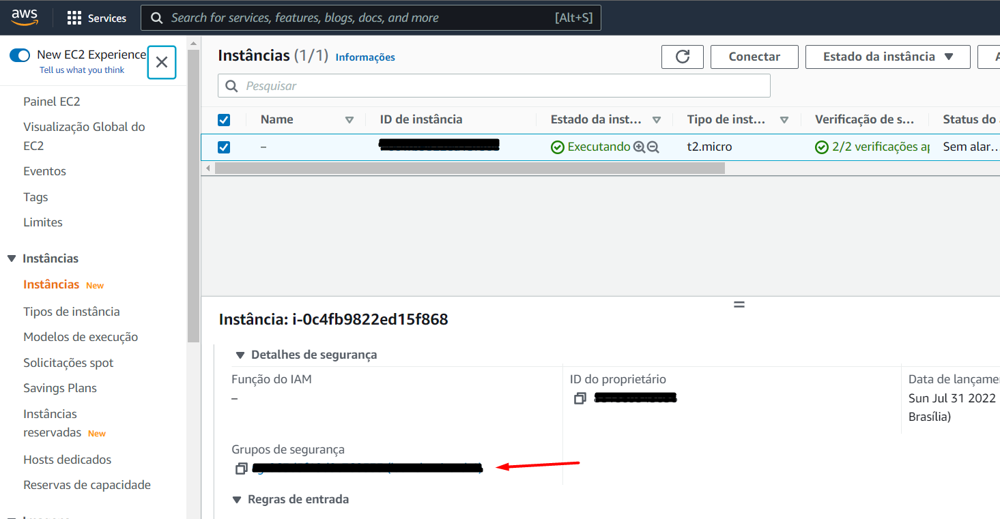

# Create a instance AWS EC2

#### Create your account in AWS


#### Access panel EC2
https://sa-east-1.console.aws.amazon.com/ec2

#### Execute instance


#### Configuration for the instance

Choose ubuntu server for your application


Create key for putty


Execute/Create instance


#### Download Putty - Access to instance


#### Access to instance

Get to key auth to instance


Entry to instance with your public IP


Login in ubuntu:

```bash
ubuntu
```

#### Update dependencies

```bash
sudo apt-get update
sudo apt-get upgrade
```

#### Install apache
    
```bash
sudo apt-get install apache2
```

#### Enable ports in AWS EC2 Manager




#### Installing UFW Firewall

```bash
sudo apt install ufw -y
```

Status:

```bash
sudo systemctl status ufw
```

Start and enabled UFW

```bash
sudo systemctl start ufw

sudo ufw enable
```

#### Allow permission port to Apache

```bash
sudo ufw allow Apache
```

Verify status UFW

```bash
sudo ufw status
```

#### Restart Apache

```bash
sudo systemctl restart apache2
```

##### Acess apache in WEB

http://<public_ip>


### Install SSL in Server

Allow Apache Full
    
```bash
sudo ufw allow "Apache Full"
```

Enable SSL
    
```bash
sudo a2enmod ssl
```

#### Create a certificate
```bash
sudo openssl req -x509 -nodes -days 365 -newkey rsa:2048 -keyout /etc/ssl/private/apache-selfsigned.key -out /etc/ssl/certs/apache-selfsigned.crt
```

#### Create a virtual Host

```bash
sudo nano /etc/apache2/sites-available/your_domain_or_ip.conf
```

```
<VirtualHost *:443>
   ServerName your_domain_or_ip
   DocumentRoot /var/www/your_domain_or_ip

   SSLEngine on
   SSLCertificateFile /etc/ssl/certs/apache-selfsigned.crt
   SSLCertificateKeyFile /etc/ssl/private/apache-selfsigned.key
</VirtualHost>
```

#### Create a directory and file for your website

```bash
sudo mkdir /var/www/your_domain_or_ip
```

```bash
sudo nano /var/www/your_domain_or_ip/index.html
```

```
<h1>Website worked!</h1>
```

#### Enable virtual host

```bash
sudo a2ensite your_domain_or_ip.conf
```

```bash
sudo systemctl reload apache2
```

##### Acess your website

https://<public_ip>

## Contributing
...
## License
[MIT](https://choosealicense.com/licenses/mit/)